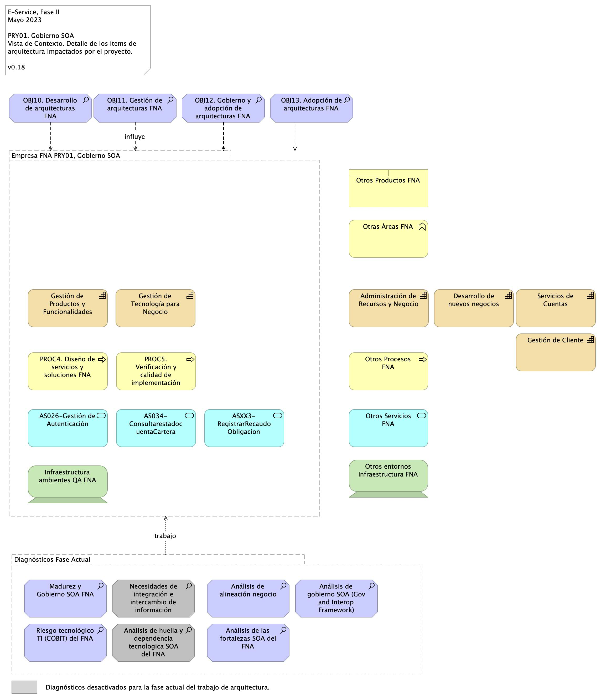

geometry:
  - top=1in
  - bottom=1in
fignos-cleveref: True
fignos-plus-name: Fig.
fignos-caption-name: Imagen
tablenos-caption-name: Tabla
...

>    E-Service. Fase II
> 
>    PRY02. Arquitectura de Referencia SOA 2.0 del FNA. Contenido de los Productos Contractuales
> 
>    Contrato 1812020
> 
>    FNA, Stefanini
> 
>    25 Jun 2023
>
>    **Versión** 1.f6c144c

 

# Producto 10: PR10. Detalle de los ítems de la empresa FNA impactados por el proyecto
Lista de las partes de la arquitectura actual del FNA relacionados con el diseño de la arquitectura de referencia SOA 2.0, objeto del proyecto.

**Nota**: el resultado de este producto está dirigido a cumplir los objetivos del proyecto PRY02. Arquitectura de Referencia SOA 2.0 del FNA. Contenido de los Productos Contractuales: desarrollo, sostenibilidad (gestión) de arquitectura de referencia.

 

## Justificación
Adelantar la aprobación por parte del Fondo Naconal del Ahorro de los contenidos de los entregables del proyecto PRY02, en su  Etapa 0, de la Hoja de Ruta E-Service, tal que garantice su continuidad y ejecución.

## Contenidos
1. Vista de segmento de la empresa, campo de acción del proyecto PRY02
1. Justificación del segmento de la empresa requerido por el trabajo de arquitectura SOA de referencia 2.0
1. Iniciativas y brechas sensibles al trabajo de arquitectura de referencia 2.0 (relación con E-Service, Fase I)

 

## Criterios de Aceptación

* Lista de los ítems de arquitectura y brechas críticas del trabajo atendidos por la arquitectura de referencia SOA 2.0 del FNA
* Descripción de los ítems del segmento de la empresa del proyecto 2 (PRY02), Arquitectura de Referencia SOA 2.0 del FNA. Contenido de los Productos Contractuales

 

## Modelo de Implementación del PRY02
{#fig: width=lin}

_Fuente: Elaboración propia._

 

*** 

---
title: Vista de Contexto
geometry:
  - top=1in
  - bottom=1in
fignos-cleveref: True
fignos-plus-name: Fig.
fignos-caption-name: Imagen
...

| Tema           | Vista de Contexto: **Elementos de la Arquitectura Impactados por el Proyecto** |
|----------------|--------------------------------------------------------------------------------|
| Palabras clave | SOA, Contexto, Áreas, Procesos, Objetivos                                      |
| Autor          |                                                                                |
| Fuente         |                                                                                |
| Version        | 1.f6c144c del 25 Jun 2023                                               |
| Vínculos       | [N001d. Ejecución Plan de Trabajo SOA](onenote:#N001d.sharepoint.com); [N003a. Procesos de Negocio FNA](onenote:#N003a.%20Procesos%20de%20Negocio%20FNA&section)|

 

# Vista de Contexto Fase II, E-Service, 2023 (181-2020)
## Elementos de la Arquitectura Impactados por el Proyecto
La vista de contexto o del segmento de empresa presenta un corte de la arquitectura del Fondo Nacional del Ahorro (FNA, en adelante) que será abordada por este proyecto. Por tanto, esta vista es una porción de la empresa FNA (segmento de empresa) acotada a las partes que son sujeto del trabajo del proyecto PRY01, Gobierno SOA, Fase II, E-Service (contrato 181-2020). Si bien, la vista contiene aquellas partes directamente relacionadas con el proyecto, también presenta en relación indirecta a otros ítems de la arquitectura del FNA.

La vista de segmento a continuación escoge las partes de la arquitectura del FNA que son sujeto del alcance del PRY01, Gobierno SOA del FNA.

{#fig:1 width=lin}

_Fuente: Elaboración propia._

 

Esta vista le informa al FNA tres objetivos importates. Primero, que el ejercicio actual, de gobierno SOA, aunque sea de caracter empresarial está condicionada por las restricciones del proyecto presente, y no debe por esto mismo abarcar la completitud de la empresa FNA, si no, únicamente las partes seleccionados como relevantes (ver [Justificación Segmento Empresa FNA](URL.com), más adelante). Por esta razón, el segmento presentado en la imagen arriba hace foco en las dichas capacidades del FNA, en esos procesos, y en tales servicios que son relevantes según las restricciones de ejecución y resultados esperados de este proyecto. 

Segundo, la vista de contexto comunica las problemáticas y operaciones a realizar a aquellas partes de la empresa FNA (aparecen en forma de trabajo, al final de la vista). Estas operaciones, en forma de diagnósticos, por ej., se deberán realizar para producir una solución dentro de los términos del proyecto, que en esta caso, es el de Gobierno SOA.

Tercero y último, la vista de segmento FNA del proyecto facilita la justificación y los criterios con los que se realizó la inclusión estos, y nuevos ítems que esta incluya.

 

## Descripción de los Elementos de la Vista de Segmento
La vista de segmento que define los ítems de arquitectura del FNA a ser abordados en esta etapa del proyecto; comprenden los siguientes
elementos.

1. Los procesos de _Diseño de Servicios y Soluciones FNA** y **Verificación y Calidad de Implementación_
1. Los objetivos representados en el gobierno y adopción de la arquitectura
1. Los servicios derivados del _Diseño de Servicios y Soluciones FNA_ y _Verificación y Calidad de Implementación_
1. La infraestructura tecnológica que soporta los servicios

 

### PROC4. Diseño de Servicios y Soluciones FNA
El diseño de servicios y soluciones, constituye una competencia a desarrollar y madurar al interior del FNA, en concordancia con las recomendaciones de los marcos de referencia: _e-Competence Framework (e-CF)—A common European Framework for ICT Professionals in all industry sectors—Part 1: Framework, 2016_ en los cuales la etapa de diseño está alineada con los requisitos de los servicios demandados por los interesados, su posterior desarrollo, la adquisición o contratación y el gobierno que se hace necesario implementar para soportar la operación:

* Gestión de la configuración
* Preparación y ejecución de pruebas
* Gestión de Requisitos y Mantenimiento
* Atención de problemas
* Atención de incidentes

El Diseño de Servicios y Soluciones, garantiza una prestación ágil y escalable de servicios y soluciones digitales del FNA, además de oportunas y rentables, capaces de apoyar los objetivos trazados en la vista de segmento de esta estapa del proyecto.

Estas soluciones digitales pueden adoptar varias formas, desde aplicaciones móviles, plataformas en línea, software personalizado, y sistemas de gestión empresarial, entre otros.

Por otra parte y en articulación al Marco para la Transformación Digital del Estado Colombiano, del MinTIC, el diseño de servicios y soluciones, integra habilidades del FNA, orientadas principalmente a lo siguiente.

* Diseño con enfoque centrado en los usuarios beneficiarios del FNA
* Solución de problemas complejos a través de la arquitectura
* Diseños ágil desde la perspectiva de salida a producción y con un adecuado uso de recursos

Estos elementos y características, corresponderán a los atributos del proceso Diseño de Servicios y Soluciones FNA, de la vista de segmento del FNA.

### PROC5. Verificación y Calidad de Implementación
Este componente dentro de la vista de arquitectura de segmento, define el éxito del diseño de servicios y soluciones, debido a la consideración de buenas prácticas, cumplimiento de normas y un adecuado gobierno en la etapa de diseño, hasta llegar a la implementación y puesta en funcionamiento.

La verificación y calidad de implementación dentro de la arquitectura de segmento, asegura que el diseño tuvo una planificación adecuada, un equipo de trabajo con las competencias necesarias, una comunicación acertiva, un modelo de desarrollo y ejecución de pruebas, un mecanismo gradual de
implementación, las respectivas capacitaciones, los requerimientos de seguridad y privacidad y la generación de hábitos y comportamientos a través del uso y apropiación de la solución desplegada.

Dentro del alcance de esta fase del proyecto, se contempla el diseño del Gobierno SOA, compuesto por elementos con líneas de actuación en completa articulación; los resultados de uno, impactan los resultados y el accionar de los demás.

Estos elementos que se relacionan a continuación:
 
* Procesos
* Estructura
* Habilidades y Competencias
* Políticas
* Cultura y Ética
* Infraestructura
* Elementos de Información\ 

 

### OBJ10. Desarrollo de Arquitecturas FNA
Dentro del dominio motivacional; una de las metas claves de la vista de segmento corresponde al desarrollo de arquitecturas, como elementos rectores de gobierno de los procesos: _Diseño de Servicios y Soluciones FNA_ y _Verificación y Calidad de Implementación_.

De acuerdo al Marco de Referencia de Arquitectura Empresarial (MRAE) del MinTIC es necesario generar una articulación entre: las iniciativas que se generan desde los dos procesos que son parte del alcance de esta fase; la ejecución de los proyectos que se generaron a partir de aquellas iniciativas; y una gestión y monitoreo de los impactos de la finalización de los proyectos y los productos que 
entregan a nivel de servicios.

A través de la práctica de arquitectura, el FNA empieza a generar un gobierno del diseño y posterior implmentación de los servicios y soluciones digitales que presta a los ciudadanos.

### OBJ11. Gestión de Arquitectura FNA
Este componente está orientado a la instauración del Gobierno de Arquitectura; con los elementos que lo componen: procesos, estructura, habilidades y competencias, políticas, cultura y ëtica, y elementos de información.

Es un objetivo a cumplir para los procesos definnidos en esta fase: _Diseño de Servicios y Soluciones FNA_ y _Verificación y Calidad de Implementación_.

 

# Referencias {.page_break_before}
<!-- Explicitly insert bibliography here -->

E-Service. Situación SOA Actual del FNA. Etapa I. (2022).

E-Service. Arquitectura de Referencia del FNA. Etapa II. (2023).

E-Service. Hoja de Ruta e Iniciativas. Etapa III. (2023).

TOGAF 9.1. Risk Management (2023). En https://pubs.opengroup.org/architecture/togaf9-doc/arch/chap27.html

