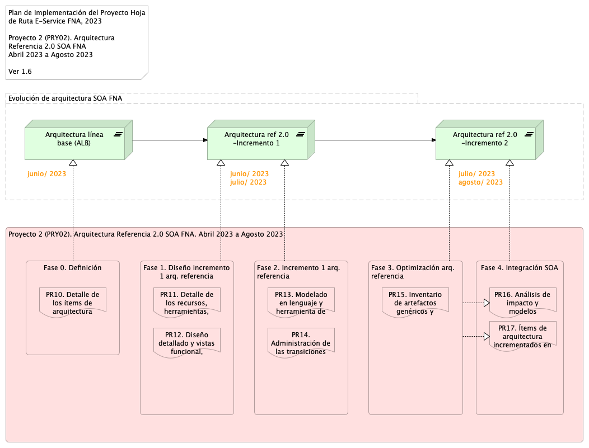
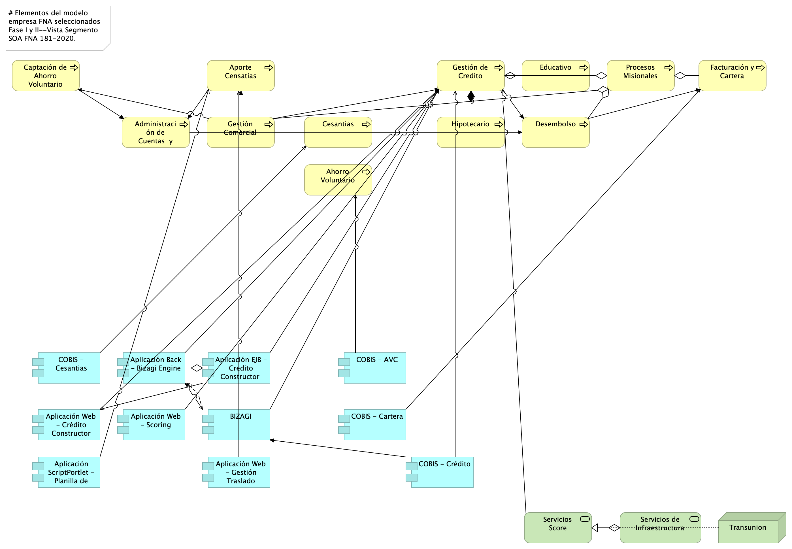

geometry:
  - top=1in
  - bottom=1in
fignos-cleveref: True
fignos-plus-name: Fig.
fignos-caption-name: Imagen
tablenos-caption-name: Tabla
...

## Objetivo del Documento
Entrega de los productos de la Etapa 2, PR11 y PR12, del proyecto PR02, Arquitectura de Referencia SOA 2.0 del FNA, flujos de trabajo y personas que ejercitan y conforman (cumplen) con el gobierno SOA del FNA a desplegar a cargo de la oficina de arquitectura.

##  Control de Cambios {.page_break_before}
| Tema           | PRY01 Gobierno SOA FNA     |
|----------------|----------------------------|
| Palabras clave | SOA, E-Service, FNA, Análisis de brecha, GAP, Comparativa              |
| Autor          |                            |
| Fuente         |                            |
| Versión        | 1.75237a9 del 24 Jul 2023 |
| Vínculos       | [N003a Vista Segmento SOA FNA](N03a%a20Vsta%20aSegenta%20SOA%20FNA.md) |

 

 

## Contenidos
\toc

\newpage

>    E-Service. Fase II
> 
>    PRY02. Arquitectura de Referencia SOA 2.0 del FNA. Contenido de los Productos Contractuales
> 
>    Contrato 1812020
> 
>    FNA, Stefanini
> 
>    24 Jul 2023
>
>    **Versión** 1.75237a9

 

# Producto 10: PR10. Detalle de los ítems de la empresa FNA impactados por el proyecto
Lista de las partes de la arquitectura actual del FNA relacionados con el diseño de la arquitectura de referencia SOA 2.0, objeto del proyecto.

**Nota**: el resultado de este producto está dirigido a cumplir los objetivos del proyecto PRY02. Arquitectura de Referencia SOA 2.0 del FNA: desarrollo, sostenibilidad (gestión) de arquitectura de referencia.

 

## Justificación
Adelantar la aprobación por parte del Fondo Naconal del Ahorro de los contenidos de los entregables del proyecto PRY02, en su  Etapa 0, de la Hoja de Ruta E-Service, tal que garantice su continuidad y ejecución.

## Contenidos
1. Vista de segmento de la empresa, campo de acción del proyecto PRY02
1. Justificación del segmento de la empresa requerido por el trabajo de arquitectura SOA de referencia 2.0
1. Iniciativas y brechas sensibles al trabajo de arquitectura de referencia 2.0 (relación con E-Service, Fase I)

 

## Criterios de Aceptación
* Lista de los ítems de arquitectura y brechas críticas del trabajo atendidos por la arquitectura de referencia SOA 2.0 del FNA
* Descripción de los ítems del segmento de la empresa del proyecto 2 (PRY02), Arquitectura de Referencia SOA 2.0 del FNA

 

## Modelo de Implementación del PRY02
{#fig: width=lin}

_Fuente: Elaboración propia._

 

\newpage

| Tema           | Vista de Contexto: **Elementos de la Arquitectura Impactados por el Proyecto** |
|----------------|--------------------------------------------------------------------|
| Palabras clave | SOA, Contexto, Áreas, Procesos, Objetivos   |
| Autor          |                                             |
| Fuente         |                                             |
| Version        | 1.75237a9 del 24 Jul 2023            |
| Vínculos       | [N001d. Ejecución Plan de Trabajo SOA](onenote:#N001d.sharepoint.com); [N003a. Procesos de Negocio FNA](onenote:#N003a.%20Procesos%20de%20Negocio%20FNA&section)|

 

# Vista de Contexto Fase II, E-Service, 2023 (181-2020)
## Elementos de la Arquitectura Impactados por el Proyecto
La vista de contexto o del segmento de empresa presenta un corte de la arquitectura del Fondo Nacional del Ahorro (FNA, en adelante) que será abordada por este proyecto. Por tanto, esta vista es una porción de la empresa FNA (segmento de empresa) acotada a las partes que son sujeto del trabajo del proyecto , Arquitectura de Referencia SOA 2.0 del FNA, Fase II, E-Service (contrato 181-2020). Si bien, esta vista presenta únicamente las partes directamente relacionadas con este proyecto, también presenta la relación indirecta a otros ítems de la arquitectura del FNA a los que este alcanza.

La vista de segmento a continuación presenta las partes de la arquitectura del FNA que son sujeto de este proyecto .

{#fig:1 width=lin}

_Fuente: Elaboración propia._

 

Esta vista le informa al FNA tres objetivos importates. Primero, que el ejercicio actual, Arquitectura de Referencia SOA 2.0 del FNA, aunque sea de caracter empresarial, está ubicado en TI, y está condicionada por las restricciones del proyecto presente. Por esta razón, no puede abarcar la completitud de la empresa FNA, sino únicamente las partes seleccionados como relevantes. De ahí que la vista del segmento de la empresa informa de aquellas partes: la vista de segmento presentada en la imagen arriba hace foco en las dichas partes, capacidades del FNA, en esos procesos, y los artefactos de software, componentes y servicios SOA que son relevantes en las restricciones de ejecución (tiempo y recursos contratados) y resultados esperados de este proyecto (productos contractuales).

Segundo, la vista de contexto comunica las problemáticas que el proyecto debe enfrentar, que sucede en las partes de la empresa que esta incluye, y las operaciones a realizar a aquellas partes de la empresa FNA. Las operaciones, que pueden ser dianósticos, análisis, procedimientos, a realizar aparecen en forma de trabajo, al final de la vista. Por ejemplo, se deberán realizar para producir una solución dentro de los términos del proyecto, que en esta caso, es el de Gobierno SOA.

Tercero y último, la vista de segmento FNA del proyecto facilita la justificación y explicación de los criterios con los que se realizó la inclusión de las partes de la empreasa que esta incluye, así como de nuevos ítems que pueda incluir durante la ejecucución del proyecto.

 

## Descripción de los Elementos de la Vista de Segmento
La vista de segmento que define los ítems de arquitectura del FNA a ser abordados en esta etapa del proyecto; <mark>comprenden los siguientes</mark>
elementos.

1. Los procesos de Diseño de Servicios y Soluciones FNA y Verificación y Calidad de Implementación
1. Los objetivos representados en el gobierno y adopción de la arquitectura
1. Los servicios derivados del _Diseño de Servicios y Soluciones FNA_ y _Verificación y Calidad de Implementación_
1. La infraestructura tecnológica que soporta los servicios

 

### PROC4. Diseño de Servicios y Soluciones FNA
El diseño de servicios y soluciones, constituye una competencia a desarrollar y madurar al interior del FNA, en concordancia con las recomendaciones de los marcos de referencia: _e-Competence Framework (e-CF)—A common European Framework for ICT Professionals in all industry sectors—Part 1: Framework, 2016_ en los cuales la etapa de diseño está alineada con los requisitos de los servicios demandados por los interesados, su posterior desarrollo, la adquisición o contratación y el gobierno que se hace necesario implementar para soportar la operación:

* Gestión de la configuración
* Preparación y ejecución de pruebas
* Gestión de Requisitos y Mantenimiento
* Atención de problemas
* Atención de incidentes

El Diseño de Servicios y Soluciones, garantiza una prestación ágil y escalable de servicios y soluciones digitales del FNA, además de oportunas y rentables, capaces de apoyar los objetivos trazados en la vista de segmento de esta estapa del proyecto.

Estas soluciones digitales pueden adoptar varias formas, desde aplicaciones móviles, plataformas en línea, software personalizado, y sistemas de gestión empresarial, entre otros.

Por otra parte y en articulación al Marco para la Transformación Digital del Estado Colombiano, del MinTIC, el diseño de servicios y soluciones, integra habilidades del FNA, orientadas principalmente a lo siguiente.

* Diseño con enfoque centrado en los usuarios beneficiarios del FNA
* Solución de problemas complejos a través de la arquitectura
* Diseños ágil desde la perspectiva de salida a producción y con un adecuado uso de recursos

Estos elementos y características, corresponderán a los atributos del proceso Diseño de Servicios y Soluciones FNA, de la vista de segmento del FNA.

### PROC5. Verificación y Calidad de Implementación
Este componente dentro de la vista de arquitectura de segmento, define el éxito del diseño de servicios y soluciones, debido a la consideración de buenas prácticas, cumplimiento de normas y un adecuado gobierno en la etapa de diseño, hasta llegar a la implementación y puesta en funcionamiento.

La verificación y calidad de implementación dentro de la arquitectura de segmento, asegura que el diseño tuvo una planificación adecuada, un equipo de trabajo con las competencias necesarias, una comunicación acertiva, un modelo de desarrollo y ejecución de pruebas, un mecanismo gradual de
implementación, las respectivas capacitaciones, los requerimientos de seguridad y privacidad y la generación de hábitos y comportamientos a través del uso y apropiación de la solución desplegada.

Dentro del alcance de esta fase del proyecto, se contempla el diseño del Gobierno SOA, compuesto por elementos con líneas de actuación en completa articulación; los resultados de uno, impactan los resultados y el accionar de los demás.

Estos elementos que se relacionan a continuación:
 
* Procesos
* Estructura
* Habilidades y Competencias
* Políticas
* Cultura y Ética
* Infraestructura
* Elementos de Información\ 

 

### OBJ10. Desarrollo de Arquitecturas FNA
Dentro del dominio motivacional; una de las metas claves de la vista de segmento corresponde al desarrollo de arquitecturas, como elementos rectores de gobierno de los procesos: _Diseño de Servicios y Soluciones FNA_ y _Verificación y Calidad de Implementación_.

De acuerdo al Marco de Referencia de Arquitectura Empresarial (MRAE) del MinTIC es necesario generar una articulación entre: las iniciativas que se generan desde los dos procesos que son parte del alcance de esta fase; la ejecución de los proyectos que se generaron a partir de aquellas iniciativas; y una gestión y monitoreo de los impactos de la finalización de los proyectos y los productos que 
entregan a nivel de servicios.

A través de la práctica de arquitectura, el FNA empieza a generar un gobierno del diseño y posterior implmentación de los servicios y soluciones digitales que presta a los ciudadanos.

### OBJ11. Gestión de Arquitectura FNA
Este componente está orientado a la instauración del Gobierno de Arquitectura; con los elementos que lo componen: procesos, estructura, habilidades y competencias, políticas, cultura y ëtica, y elementos de información.

Es un objetivo a cumplir para los procesos definnidos en esta fase: _Diseño de Servicios y Soluciones FNA_ y _Verificación y Calidad de Implementación_.

 

#Vistas de Apoyo al Segmento de la Empresa

{#fig: width=}

_Fuente: Diagnóstico SOA. E-Service (2022)._

 

{#fig: width=}

_Fuente: Diagnóstico SOA. E-Service (2022)._

 

{#fig: width=}

_Fuente: Diagnóstico SOA. E-Service (2022)._

 

{#fig: width=}

_Fuente: Diagnóstico SOA. E-Service (2022)._

 

{#fig: width=}

_Fuente: Diagnóstico SOA. E-Service (2022)._

 

{#fig: width=}

_Fuente: Diagnóstico SOA. E-Service (2022)._

 

\newpage

>    E-Service. Fase II
> 
>    PRY02. Arquitectura de Referencia SOA 2.0 del FNA. Contenido de los Productos Contractuales
> 
>    Contrato 1812020
> 
>    FNA, Stefanini
> 
>    24 Jul 2023
>
>    **Versión** 1.75237a9

 

# Producto 11: PR11. Detalle de los recursos, herramientas, roles, responsabilidades y participantes
La arquitectura SOA de referencia SOA 2.0 del FNA, objeto de este proyecto, la forman las estructuras e integraciones de productos y servicios SOA. Esta es el soporte de decisiones de la Vicepresidencia de tecnología del FNA, tanto de desarrollo, mejoras a las aplicacionas y herramientas de software del FNA, y para la adquisición y migración de tecnologías específicas. 

Este producto define los elementos mínimales para garantizar la vigencia y ejercicio de la arquitectura de referencia SOA, objeto de este proyecto, y línea base para dirigir el diseño, desarrollo y entrega de los servicios SOA y tecnologías del FNA.

 

## Justificación
Los objetivos del Gobierno SOA del FNA (Proyecto 1, E-Service, Fase II): Mantenimiento de Relación Negocio - Arquitectura (G-OBJG), y Seguimiento a cambios en la arquitectura de referencia (G-OBJS3) exigen la mantenibiliad de la arquitectura de referencia, responsable de 1) dirigir y evolucionar las soluciones tecnológica del FNA, 2) de orientar el diseño de las estas, y 3) ser el instrumento de control para hacer cumplir los principios de diseño de servicios SOA del FNA y del Manual de Gobierno. Para lograr estos objetivos y responsabilidadas dadas, es necesario que desde este proyecto se detallen los recursos, herramientas, roles, responsabilidades y participantes que garanticen que los procesos y operaciones de gestión, cambio y vigencia de la arquitectura de referencia sean puestos en marcha cuando el FNA así lo considere.

## Contenidos
1. Flujo de trabajo del mantenimiento de la arquitectura de referencia (Oficina de Arquitectura del FNA)
1. Principios y operaciones de mantenimiento de la arquitectura de referencia (Oficina de Arquitectura del FNA)
1. Matriz de responsabilidades del mantenimiento de la arquitectura de referencia (Oficina de Arquitectura del FNA)

 

## Criterios de Aceptación
* Entendimiento de las operaciones y mantenibilidad de la arquitectura de referencia SOA 2.0 del FNA
* Matriz de roles y procedimientos encargados de mantenibilidad de la arquitectura de referencia SOA 2.0

 

## Modelo de Implementación del PRY02
{#fig: width=}

_Fuente: Elaboración propia._

 

\newpage

>    E-Service. Fase II
> 
>    PRY02. Arquitectura de Referencia SOA 2.0 del FNA. Contenido de los Productos Contractuales
> 
>    Contrato 1812020
> 
>    FNA, Stefanini
> 
>    24 Jul 2023
>
>    **Versión** 1.75237a9

 

# Producto 12: PR12. Diseño detallado y vistas funcional, despliegue, información, integración y tecnología​
La arquitectura de referencia SOA 2.0 del FNA, objeto de este proyecto, la forman las estructuras e integraciones entre datos, productos y servicios SOA. Virtus de esto, es el soporte de decisiones de la Vicepresidencia de tecnología del FNA, tanto de desarrollo, mejoras a las aplicaciones y herramientas de software del FNA, y para la adquisición y migración de tecnologías específicas.

Este producto del proyecto define la línea base de la arquitectura de referencia 2.0 del FNA, necesaria para dirigir el desarrollo de los servicios SOA del FNA hacia diseños y tecnologías determinadas en este plano de referencia (como microservicios, REST, API, infraestructura Nube, etc.) y favorece la adopción del _estilo de arquitectura orientado a eventos_ para atender las funcionalidades y necesidades de negocio, que para este proyecto son prioridad la vicepresidencia de operaciones y la vicepresidencia de crédito del FNA.

 

## Justificación
La Arquitectura de Referencia SOA 2.0 del Fondo Nacional del Ahorro (PR12), que incorpora las problemáticas de gobierno SOA a partir de las que se plantea este producto, busca la prevalencia, el fortalecimiento y la optimización de las arquitecturas de servicios SOA relacionadas con las apicaciones del FNA, y en concosrdancia con los análisis realizados en la Fase I, E-Service (2022). Esta permitirá, una vez modelada la arquitectura de objeto de referencia de este proyecto, realizando las operaciones requeridas por el proyecto Gobierno SOA del FNA (PRY01, E-Service Fase II) a los segmentos y componentes base, principios, metodologías, estándares, lineamientos y tecnologías.

La Arquitecturas de referencias 2.0 es la responsable de definir y evolucionar las arquitecturas de solución tecnológica del FNA, y su propósito es orientar el diseño de las soluciones delimitando e introduciendo restricciones positivas en cuanto a parámetros, patrones y atributos de calidad. Además, es un instrumento de control para hacer cumplir los principios de diseño de servicios SOA del FNA y del Manual de Gobierno.

## Contenidos
1. Diseño y representación de la Arquitectura de Referencia 2.0 del FNA
2. Consideraciones para implementar la arquitectura de referencia
3. Vistas lógicas y conceptuales de los sistemas de información
4. Documentación técnica 0.1 de la Arquitectura de Referencia 2.0 del FNA

 

## Criterios de Aceptación
* Vistas lógicas y conceptuales de los sistemas de información
* Validación de la Arquitectura de Referencia 2.0 del FNA [- Plantilla "Gestión y Gobierno Arquitectura Empresarial (Mega Hopex) MIPG, MRAE, Marco Transformación Digital, TOGAF"]

 

## Modelo de Implementación del PRY02
{#fig: width=}

_Fuente: Elaboración propia._

 

\newpage

| Tema           | Diseño detallado y vistas funcional, despliegue, información, integración y tecnología​: **Flujo de trabajo del mantenimiento de la arquitectura de referencia** |
|----------------|----------------------------------------------------------------------|
| Palabras clave | SOA, Arquitectura de referencia, características, dominios, servivios, aplicaciones, datos, |
| Autor          |                                                              |
| Fuente         |                                                              |
| Versión        | **1.75237a9** del 24 Jul 2023                         |
| Vínculos       | [Ejecución Plan de Trabajo SOA](onenote:#N001d.sharepoint.com); [Procesos de Negocio FNA](onenote:#N003a.com)|

 

# Diseño y Representación de las Arquitecturas de Referencia 2.0 del FNA
Partimos de la representación de la vista general actual de la arquitecturas del FNA y que implica a las problemáticas diagnósticadas en Fase I @eservices1-22. Sobre este plano realizaremos luego las propuestas de nuevas arquitecturas respecto a la actual dirigidas a enfrentar dichas problemáticas allí planteadas, y que se resumen en las siguientes.

1. Dependencia de proveedor (OBJ1)
1. Fortaleza SOA de las aplicaciones (OBJ2)
1. Tiempo de mercado (OBJ3)

_Fuente: E-Service, Fase I (2022)._

## Dominio de Servicios y Aplicaciones FNA
### Plano General Actual 
El propósito de traer como referencia el plano actual de arquitectura del FNA es recordar dicho esquema  para poderlo comparar con la arquitectura propuesta.

{#fig: width="12in" height="7in"}

 

### Plano General Objetivo
Presentamos la arquitectura de referencia propuesta dividida en dos niveles de detalle.

#### Nivel de detalle 1

{#fig: width="13in" height="7in"}

 

#### Nivel de detalle 2

{#fig: width="13in" height="7in"}

 

## Dominio de Datos FNA
Para la arquitectura SOA objetivo se propone un enfoque conocido como malla de datos. Este paradigma permite pensar en los datos como productos: disponibles y gestionados para su consumo como un producto. La malla de datos introduce cambios organizativos y de procesos que el Fondo Nacional necesitará para gestionar los datos como un activo de capital tangible del negocio.

Una malla de datos tiene como principal objetivo que estos sean más accesibles y estén disponibles para los usuarios, conectando directamente a propietarios, los productores y los consumidores de datos. La malla de datos trae beneficios como la mejora de los resultados empresariales de las soluciones centradas en los datos, y también impulsa la adopción de arquitecturas de datos modernas.

### Pilares de la Malla de Datos (data mesh)
{#fig: width="6in" height="3in"}

### Plano de Datos Objetivo (data mesh)
El desarrollo de la arquitectura candidata de información integrará los marcos de referencia TOGAF, el marco de referencia DAMA y las disposiciones de la política de gobierno digital, en particular las
especificadas por el Marco de Referencia de Arquitectura Empresarial para entidades del Estado Colombiano - MRAE para orientar la evaluación del estado actual y la definición del estado deseado integrando
capacidades para el gobierno de datos, arquitectura de datos, diseño y modelamiento de datos, operaciones y almacenamiento de datos, seguridad de datos, interoperabilidad e integración de datos, gestión documental y contenido, datos maestros y de referencia, inteligencia de negocios y analítica, metadatos y calidad de datos.

{#fig: width="6in" height="3.5in"}

La Ilustración a continuación muestra los marcos de referencia aplicables al dominio de Información:

{#fig: width="6.1375in" height="2.410416666666667in"}

### Características Principales de la Arquitectura de Datos 2.0 del FNA
**Propiedad impulsada por el dominio**: el primer principio de un data
mesh es transferir el poder de los datos y su propiedad a las manos de los equipos de dominio del FNA, es decir a las vicepresidencias y sus departamentos y unidades de negocio. Ellos serán los dueños de los datos de un extremo a otro, y podrán asegurarse de tener desde las fuentes correctas hasta los procesamientos necesarios y la entrega de los datos para que otros equipos de dominio los aprovechen como productos.

**Datos como producto:** los equipos de dominio son responsables de los datos y también de los productos de datos resultantes. El objetivo es lograr que cada "producto de datos" sea descubierto y utilizable por los consumidores y otros equipos de dominio, y el propietario del dominio es responsable de mantener y actualizar (o desaprobar) estos productos para garantizar la calidad y la precisión.

**Infraestructura de autoservicio**: autoservicio es la tendencia a dejar las tecnologías complejas y las
habilidades de nicho. El Data mesh se basa, por principio, en una gestión de datos mediante una plataforma común y un conjunto de herramientas que cualquier equipo de dominio pueda aprovechar.

**Gobernanza federada**: si de verdad debemos eliminar controles de acceso necesitamos un equilibrio entre las políticas y controles de gobernanza global y la posibilidad de dominio y creación de productos. Esto es lo que llamamos gobernanza federada, y en la práctica es fundamental para garantizar la privacidad, el cumplimiento y la posibilidad de escalar.

## Dominio de Infraestructura FNA
Para la arquitectura SOA objetivo se propone un enfoque de computación en la nube donde se hace uso de componentes IaaS y PaaS. Dentro de la oferta actual de componentes se pueden encontrar soluciones que permiten garantizar escalabilidad, disponibilidad, cumplimiento regulatorio y menores tiempos de salida al mercado.

 

### Arquitectura Objetivo
{width="6.1in" height="3.5in"}

 

### Principales Características

**Arquitectura sin servidor para la interfaz web**: Distribución de contenidos con baja latencia y altas velocidades de transferencia usando CDN hospedando el contenido estático de la aplicación en un servicio de almacenamiento de objetos, eliminando la necesidad de utilizar servidores en esta capa.

**Enfoque de microservicios**: Permite obetener capacidad de cómputo particular según sea requerido para soportar la carga. 

**Exposición de la funcionalidad de negocio a través de API Gateway**: Entrega las solicitudes a los microservicios, habilitando la gestión de API para establecer modelos de Calidad en el Servicio (QoS) y controlando la autenticación y autorización.

**Orquestación de contenedores**: Los administradores de Kubernetes permiten automatizar tareas clave como los parches, el aprovisionamiento de nodos y las actualizaciones. El gestior de Kubernetes por lo general permite  gestionar dinámicamente la creación o terminación de nodos y contenedores en base a la demanda.

**Service mesh**: Permite distribuir la carga proveniente de API Gateway, obteniendo mayor visibilidad y controles uniformes del tráfico de red.

**Servicios administrados**: Se aprovechan para elementos tales como la gestión de cache y bases de datos (relaciones y no relacionales). Con esto se evitan  tareas administrativas, como el aprovisionamiento de hardware, parches de software, configuración, ajustes,recuperación de fallos y backups.

**Integración de sistemas**: A través de un enlace Virtual Private Network (VPN) La funcionalidad se expone a través de el Bus de Servicios, habilitando un modelo híbrido de aplicaciones nativas de nube y al mismo tiempo de arquitectura orientada a servicios (SOA).

12b.consideraciones.md

\newpage

| Tema           | Diseño detallado y vistas funcional, despliegue, información, integración y tecnología​: **Consideraciones para implementar la arquitectura de referencia** |
|----------------|----------------------------------------------------------------------|
| Palabras clave | SOA, Arquitectura de referencia, características, implementación, hoja de ruta,  |
| Autor          |                                                              |
| Fuente         |                                                              |
| Versión        | **1.75237a9** del 24 Jul 2023                         |
| Vínculos       | [Ejecución Plan de Trabajo SOA](onenote:#N001d.sharepoint.com); [Procesos de Negocio FNA](onenote:#N003a.com)|

 

# Consideraciones para Implementar las Arquitecturas de Referencia del FNA
Partimos de la representación de la vista general de arquitectura actual del FNA, que desembocaron en las problemáticas diagnósticadas en Fase I (@eservices1-22) sobre la que realizaremos luego las propuestas de nuevas arquitecturas que 

Este documento presenta la visión general de la arquitectura de referencia del FNA. Contiene propuestas a futuro sobre los cambios y adiciones sugeridas con respecto a la arquitectura de referencia actual.

12c.vistas.md

\newpage

| Tema           | Diseño detallado y vistas funcional, despliegue, información, integración y tecnología​: **Flujo de trabajo del mantenimiento de la arquitectura de referencia** |
|----------------|----------------------------------------------------------------------|
| Palabras clave | SOA, Arquitectura de referencia, características,                     |
| Autor          |                                                              |
| Fuente         |                                                              |
| Versión        | **1.75237a9** del 24 Jul 2023                       |
| Vínculos       | [Ejecución Plan de Trabajo SOA](onenote:#N001d.sharepoint.com); [Procesos de Negocio FNA](onenote:#N003a.com)|

 

# Diseño y Representación de las Arquitecturas de Referencia 2.0 del FNA
Partimos de la representación de la vista general de arquitectura actual del FNA, que desembocaron en las problemáticas diagnósticadas en Fase I (@eservices1-22) sobre la que realizaremos luego las propuestas de nuevas arquitecturas que 

Este documento presenta la visión general de la arquitectura de referencia del FNA. Contiene propuestas a futuro sobre los cambios y adiciones sugeridas con respecto a la arquitectura de referencia actual.

\newpage

>    E-Service. Fase II
>
>    PRY02. Arquitectura de Referencia SOA 2.0 del FNA. Contenido de los Productos Contractuales
>
>    Contrato 1812020
>
>    FNA, Stefanini
>
>    24 Jul 2023
>
>    **Versión** 1.75237a9

 

# Producto 13: PR13. Modelado en lenguaje y herramienta de diseño del FNA​
El principal entregable de este producto son los modelos de arquitevtura de referencia 2.0 del FNA. Para la mayoría de los casos, y en este contexto, los modelos refieren a conjuntos información de ingeniería (no se agotan en solo diagramas o documentos) relevante a los sistemas de información, servicios, componentes y herramientas de software del FNA representados con el lenguaje de descripción de arquitectura designado, que para el caso es Archimatye 3.0. Nota: distintos modelos de igual importancia que la arquitectura del FNA pueden estar representados en otros lenguajes de componentes, procesos de negocio, rndimiento, redes de comunicaciones.

Otro entregable primario de este producto es la documentación técnica inicial con la que denotamos a las espeficaciones de línea base de la arquitectura de referencia 2.0 del FNA. Siendo que esta información textual puede ser considerada como discreta y de que no puede ser verificada (distinta de los modelos), sigue teniendo la ventaja de que es fácil de comunicar.

Juntos, los modelos y las especificaciones y requerimientos de arquitectura, estos entregables constituyen lo que llamamos la Arquitectura de Referencia SOA 2.0 del FNA, y que además de ser una línea base, tiene la responsabilidad adicional de ser la hoja de ruta y, por tanto, guía de la transformación de las arquitectura estado actual hacia esta nueva versión.

**Nota**: los análisis de este producto están dirigidos a cumplir los objetivos del proyecto PRY01, Gobierno SOA: desarrollo, gestión, gobierno de arquitectura y adopción.

 

## Justificación
La representación de la información de ingeniería relevante a los sistemas de información, servicios, componentes y herramientas de software del FNA en elementos de un modelo de arquitecturas supone algunas ventajas frente a la información textual, y de cualquier otro tipo, y de ahí el mérito de estos. Una de estas ventajas es que los modelos pueden acopiar y _asociarse (mapear) con requerimientos de arquitectura mediante unidades de trabajo accionables como épicas, casos de uso, historias y escenarios_. Además, los modelos comportan la ventaja de que son verificables y de fácil transporte. Pero ninguna de estas razones es lo más importante. La verdadera justificación de tener modelado de esta arquitectura de referencia 2.0 (en un lenguaje de descripción de arquitectura) es que el FNA cuente con la creación de un entorno centrado en modelos, el cual, deja abierta la posiblida de la aplicación de técnicas y creación de productos de ingeniería.

## Contenidos
1. Análisis de los elementos del modelo de la arquitectura de referencia SOA 2.0 del FNA
1. Repositorio de arquitectura del FNA actualizado con arquitectura de referencia
1. Documentación técnica 0.2 de la arquitectura de referencia SOA
1. Proceso de mantenimiento de la arquitectura de referencia SOA 2.0 del FNA

 

## Criterios de Aceptación
* Repositorio de arquitectura del FNA actualizado con arquitectura de referencia
* Entendimiento del proceso de mantenimiento de la arquitectura de referencia SOA 2.0 del FNA y sus implicaciones

 

## Repositorio de Arquitectura del FNA, versión 0.1
{#fig: width=}

_Fuente: Diagnóstico SOA. E-Service (2022)._

## Modelo de Implementación del PRY02
{#fig: width=}

_Fuente: Elaboración propia._

 

\newpage

# Referencias {.page_break_before}
<!-- Explicitly insert bibliography here -->

@eservices1-22 @eservices3-22 @eservices4-22 @eservices5-23 @eservices6-12 @eservices7-23 @bptrends07

